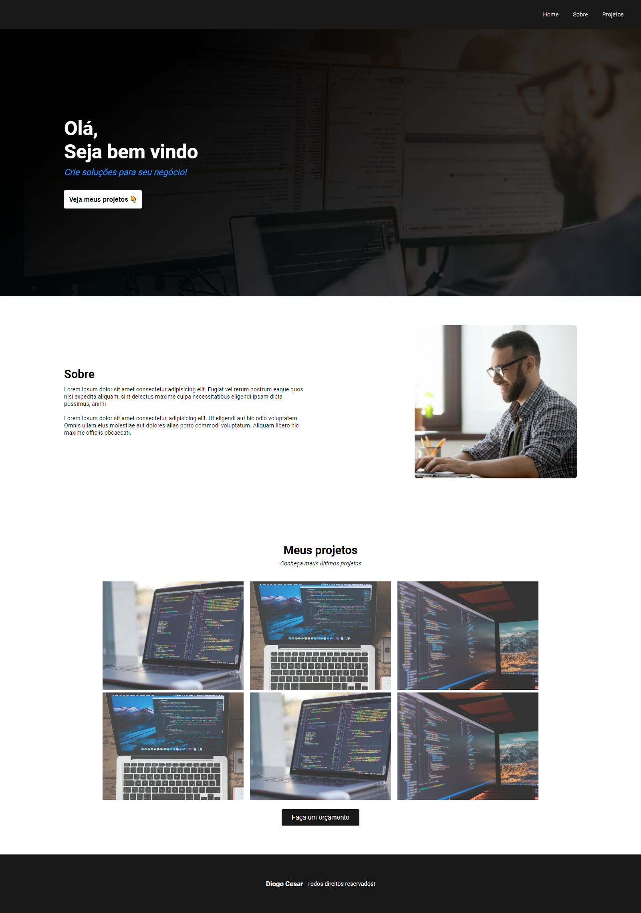

# Projeto-HTML-CSS

## Descrição

Este é um projeto de um Portfolio Web desenvolvido com HTML e CSS. Ele foi criado como parte do Curso Sujeito Programador, onde foram abordados conceitos e técnicas de desenvolvimento web utilizando essas tecnologias.

## Conteúdo

1. 

## Instruções de Uso

1. Clone este repositório para o seu computador:

  git clone https://github.com/DiogoCesar-dev/Projeto-HTML-CSS.git

2. Navegue até o diretório do projeto:

cd Projeto-HTML-CSS

3. Abra o arquivo `index.html` em seu navegador web.

## Contribuição

Contribuições são bem-vindas! Se você quiser melhorar este projeto, sinta-se à vontade para abrir uma "issue" para discutir suas ideias ou enviar um "pull request" com suas alterações.

## Licença

Este projeto está licenciado sob a Licença MIT. Consulte o arquivo [LICENSE](LICENSE) para obter mais detalhes.

## Contato

Para mais informações sobre o projeto, entre em contato com [Diogo Cesar](mailto:diogocesar.2127@gmail.com).

